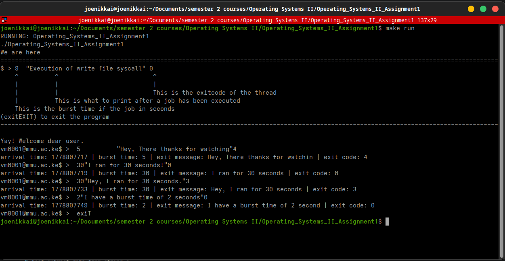
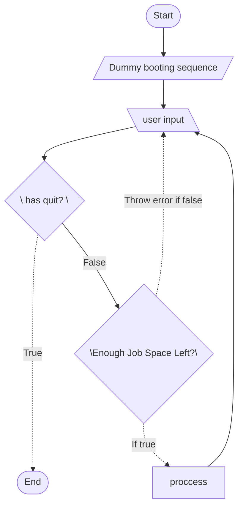

# operating systems II assignment 1 - v1.0.0

This is an assignment to BCT-222 Y1 S2 students given in [Multimedia University of Kenya](https://mmu.ac.ke)

> [Make a program in your desired language illustrating shotest job first preemptive. Work in groups](./docs/pdf/Group%20Assignment.pdf)

## The implementation plan

We are going to use the C programming language.
We are going to use arrays of pointers to store retrieve and execute a job.
We are going to use the `time.h` library to track time.
We are going to quatify time in seconds.
We are going to use user input as our set.
We are going to represent user input in the format below.

```sql
$ > 9  "Execution of write file syscall"  0
    ^          ^                          ^
    |          |                          |
    |          |                          This is the exitcode of the thread
    |          This is what to print after a job has been executed
    This is the burst time if the job in seconds
```

We are going to use regex as our regular expression matching algoritm.

The maximmum number of jobs we can have in a specific time will be 255.
The maximum burst time is going to be 4 minutes 15 seconds.
We will use `uint8_t` from `stdint.h` a one byte integer.

### Commands

- `burst "message" exit_code`: Add a new process to the scheduler.
- `ls [in|sus|done]`: List incoming, suspended, or completed processes.
- `query`: Generate `gantt_chart.svg` and `process_table.svg` and display performance metrics.
- `help`: Display the available commands list.
- `clear`: Clear the input window.
- `exit`: Exit the program.

### Reports

The `query` command generates two SVG files:
1. `gantt_chart.svg`: A visual representation of the SRTF scheduling with proportional block widths.
2. `process_table.svg`: A detailed table containing Process IDs, Arrival Times, Burst Times, Exit Times, Turnaround Times (TAT), Waiting Times (WT), and Exit Messages.

## Docker Setup

This project is fully dockerized for cross-platform compatibility (Windows, Linux, macOS).
Refer to [README_DOCKER.md](./README_DOCKER.md) for instructions.

## REPL

This is how our loop looks like



## data flow diagram




